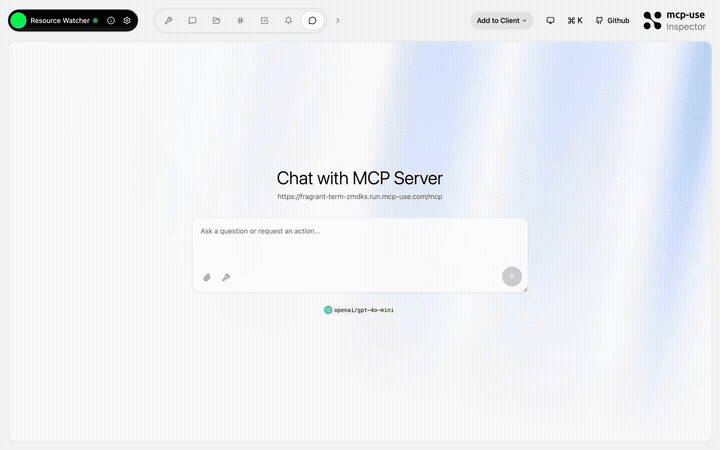
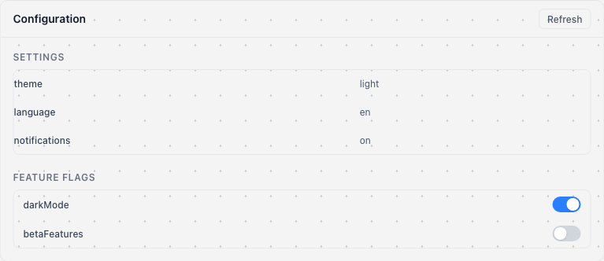

# Resource Watcher — MCP resources, subscriptions, and roots

<p>
  <a href="https://github.com/mcp-use/mcp-use">Built with <b>mcp-use</b></a>
  &nbsp;
  <a href="https://github.com/mcp-use/mcp-use">
    
  </a>
</p>

Showcase of MCP resources, resource templates, subscriptions, change notifications, and client root listing. Includes a config panel widget with live updates when resources change.



## Try it now

Connect to the hosted instance:

```
https://fragrant-term-zmdks.run.mcp-use.com/mcp
```

Or open the [Inspector](https://inspector.manufact.com/inspector?autoConnect=https%3A%2F%2Ffragrant-term-zmdks.run.mcp-use.com%2Fmcp) to test it interactively.

### Setup on ChatGPT

1. Open **Settings** > **Apps and Connectors** > **Advanced Settings** and enable **Developer Mode**
2. Go to **Connectors** > **Create**, name it "Resource Watcher", paste the URL above
3. In a new chat, click **+** > **More** and select the Resource Watcher connector

### Setup on Claude

1. Open **Settings** > **Connectors** > **Add custom connector**
2. Paste the URL above and save

## Features

- **MCP resources** — static and templated resources with URIs
- **Subscriptions** — `resources/subscribe` with change notifications
- **Resource templates** — dynamic resources with URI template params
- **Client roots** — `server.listRoots()` to discover client workspace roots
- **Config panel widget** — live config editing with resource sync

## Tools

| Tool | Description |
|------|-------------|
| `show-config` | Show the current configuration in a live panel |
| `update-config` | Update a configuration key/value pair |
| `toggle-feature` | Toggle a feature flag on or off |
| `list-roots` | List all client workspace roots |

## Available Widgets

| Widget | Preview |
|--------|---------|
| `config-panel` |  |

## Local development

```bash
git clone https://github.com/mcp-use/mcp-resource-watcher.git
cd mcp-resource-watcher
npm install
npm run dev
```

## Deploy

```bash
npx mcp-use deploy
```

## Built with

- [mcp-use](https://github.com/mcp-use/mcp-use) — MCP server framework

## License

MIT
